# ByteChef Feature Mind Map

A visual map of all features on the `0_732` branch, derived from the client navigation, routes, and server module structure.

```mermaid
mindmap
  root((ByteChef))
    Automation
      Projects
        Workflow Editor
        Code Workflows
        Templates & Sharing
        Git Configuration
      AI Hub
        Copilot Conversations
        Workflow Chats
        Personal Agents
          Schedules
          Tool Configuration
        Tasks Sidebar
        Composer
          Attachments
          Connectors Menu
          Skills Menu
        Resource Panels
          Charts
          File Viewer
          Data Table Viewer
          Knowledge Base Viewer
          Workflow & Execution Viewer
          Interactive HTML Pane
        Agent Tools
          Pinned Tools
          Searchable Tool Catalog
          Specialist Subagents
            Research
            Data Analyst
            Image Generator
            Slide Builder
            Manager Agents
      Deployments
        Project Deployments
        API Collections
        MCP Servers
        Context Store
      Data
        Data Tables
        Knowledge Bases
        Files
      Workflow Executions
      Connections
        Private / Workspace / Organization Visibility
      Approval Tasks
      AI
        AI Gateway
        Memories
        Skills
    Embedded iPaaS
      Integrations
      Integration Configurations
      MCP Servers
      App Events
      Automations
      Connected Users
      Workflow Executions
      Connections
      Signing Keys & API Keys
      Unified API
    Workflow Engine
      Atlas Core
        Coordinator
        Execution
        Worker
        Configuration
      Task Dispatchers
        Branch & Condition
        Loop / Each / Map
        Fork-Join & Parallel
        Subflow
        Approval
        On-Error
        Suspend / Terminate
      Triggers
        Webhooks
        Schedules
        App Events
      Expression Evaluator
      Polyglot Code Execution
        Java / JavaScript / Python / Ruby
    Connectors
      185+ Components
        CRM & Sales
        Marketing & Communication
        Project Management
        Developer Tools
        AI & ML Services
        Databases & Storage
        E-commerce & Finance
        Files & Helpers
      Custom Components
      API Connectors
        Manual / Import / AI-generated
      Component Policies
      Connector SDK & CLI
    Platform & Settings
      Workspaces
      Organization
        Users & Roles
        Identity Providers SSO
        AI Providers
        Management MCP Server
        Components Settings
        Notifications
        Admin API Keys
        OAuth2 Clients
        Audit Events
        License
      Account
        Profile & Password
        MFA
        Linked Accounts
        Appearance
        Active Sessions
      Security
        OAuth2 Authorization Server
        Signed File URLs
        Encryption
        Multi-tenancy
    AI Platform
      Copilot
        Workflow Editor Assistant
        Domain Specialists
      MCP
        MCP Servers per Workspace
        MCP Client Component
        Workflows as Tools
      AI Gateway EE
      AI Observability EE
      AI Evaluation EE
      Guardrails & RAG
    Infrastructure
      PostgreSQL & Liquibase
      Message Brokers
        Redis / RabbitMQ / Kafka / SQS
      File Storage Providers
      Docker & Kubernetes Helm
      EE Microservices
        API Gateway
        Coordinator / Worker Apps
        Webhook & Scheduler Apps
        AI Copilot & AI Gateway Apps
      Global Search
      Feature Flags
```

## Outline

### 1. Automation (workspace product)
- **Projects** — organize workflows; visual workflow editor, code workflows, project/workflow templates and sharing, per-workspace Git configuration for project sync.
- **AI Hub** — conversational agent surface: copilot conversations, workflow chats (chat with a running workflow), personal agents with schedules and per-agent tool configuration; task sidebar, rich composer (attachments, connectors, skills), resource panels (charts, files, data tables, knowledge bases, workflows, executions, interactive HTML); three-tier tool architecture (pinned tools, searchable catalog, specialist subagents including research, data analyst, image generator, slide builder, and manager subagents for MCP / personal agents / deployments / API collections).
- **Deployments** — project deployments per environment, API collections (expose workflows as REST APIs), MCP servers (expose workflows as MCP tools via `fromAi` mapping), context store.
- **Data** — data tables, knowledge bases (pgvector-backed RAG), asset files.
- **Workflow Executions** — execution history, step-by-step debugging, test mode.
- **Connections** — credential management with private/workspace/organization visibility (EE), OAuth2 flows.
- **Approval Tasks** — human-in-the-loop approvals with resume forms.
- **AI** — AI gateway, agent memories, reusable skills (write or upload).

### 2. Embedded iPaaS (white-label product)
Integrations, integration configurations, embedded MCP servers, app events, automations, connected users, executions, connections, signing keys / API keys, unified API layer.

### 3. Workflow Engine (Atlas)
Coordinator, execution lifecycle, workers, workflow configuration; task dispatchers (branch, condition, each, loop, map, fork-join, parallel, subflow, approval, on-error, suspend, terminate); webhook/schedule/app-event triggers; expression evaluator; GraalVM polyglot code execution (Java, JavaScript, Python, Ruby).

### 4. Connectors
185+ built-in components across CRM, marketing, communication, project management, developer tools, AI/ML, databases, storage, e-commerce, finance, files, and helper utilities; custom components; API connectors (manual, OpenAPI import, AI-generated); component policies; connector SDK and scaffolding CLI.

### 5. Platform & Settings
Workspaces; organization administration (users/roles, SSO identity providers, AI providers, management MCP server, components settings, notifications, admin API keys, OAuth2 clients, audit events, license); account (profile, password, MFA, linked accounts, appearance, sessions); security (OAuth2 authorization server, HMAC-signed file URLs, encryption, multi-tenancy).

### 6. AI Platform
Workflow copilot with domain specialist agents; MCP integration (servers per workspace/embedded/management, MCP client component, workflows-as-tools); EE: AI gateway, observability, evaluation, prompts, guardrails, RAG.

### 7. Infrastructure
PostgreSQL + Liquibase, pluggable message brokers (memory, Redis, RabbitMQ, Kafka, JMS, AMQP, AWS SQS), file storage abstraction, Docker / Kubernetes Helm deployment, EE microservices (API gateway, coordinator, worker, webhook, scheduler, AI copilot, AI gateway, config server, etc.), global search, feature flags.
